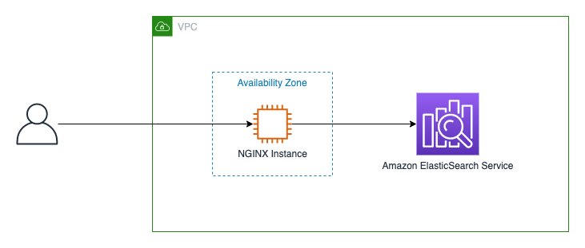
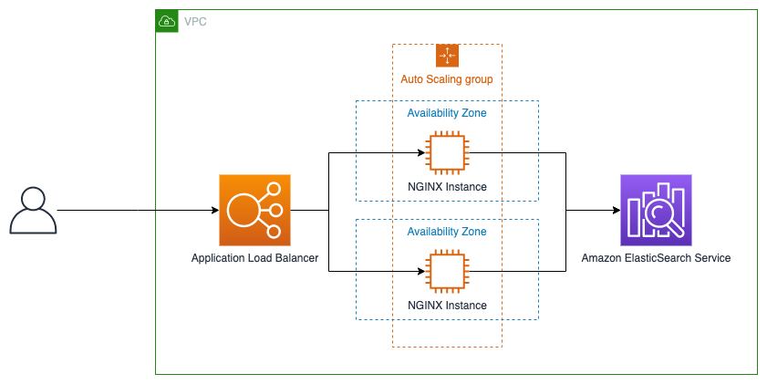
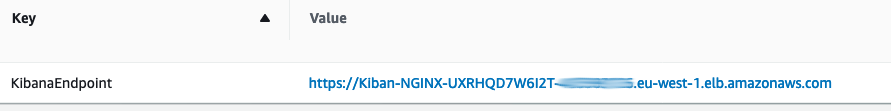

# Launch a NGINX proxy to access Kibana from outside a VPC that's using Amazon Cognito authentication

If an AWS Elasticsearch cluster is in a virtual private cloud (VPC) Kibana is only accessible inside this VPC.
There are several way´s to access Kibana from outside that VPC as described [here](https://aws.amazon.com/de/premiumsupport/knowledge-center/kibana-outside-vpc-cognito-elasticsearch/)

This sample templates can be used as a starting point to provision a NGINX Proxy to access Kibna following the guidance from [this post](https://aws.amazon.com/premiumsupport/knowledge-center/kibana-outside-vpc-nginx-elasticsearch/)

### Option 1: Deploy a single instance



With this Option only a single instance with an NGINX Proxy is deployed in the given Subnet.

Deploy to your account:

```bash
aws cloudformation deploy \
    --template-file es-nginx-single.yaml \
    --stack-name <STACKNAME> \
    --parameter-overrides ESHost=<ES-HOST> \
        CognitoHost=<COGNITO-HOST> \
        VPCID=<VPC> \
        SubnetID=<SUBNET> \
    --region <REGION>
```

### Option 2: Deploy in an Autoscaling Group



With this Option, the Proxy is deployed in an Autoscaling Group with an Application Load Balancer in Front. This is the recommended deployment 
for High Availability.

You must specify at least 2 public Subnets. Every Subnet must be in another Availability Zone.

You must also provide a Certificate for the HTTPS Listener of the Application Load Balancer.

```bash
aws cloudformation deploy
    --template-file es-nginx.yaml \
    --stack-name <STACKNAME> \
    --parameter-overrides ESHost=<ES-HOST> \
        CognitoHost=<COGNITO-HOST> \
        VPCID=<VPC-ID> \
        ALBSubnets=<SUBNET1-ID>,<SUBNET2-ID> \
        SSLCertificate=<CERTIFICATE-ARN>
    --region <REGION>
```

### Access the Example Dashboard

After the stack is created the Link to the dashboard is available in the Stack Outputs.



Or via console.

```bash
aws cloudformation describe-stacks  \
        --stack-name <STACKNAME>  \
        --query 'Stacks[0].Outputs[?OutputKey==`KibanaEndpoint`].OutputValue' \
        --region <REGION>   
```

## Cleaning Up

To avoid incurring charges, delete the AWS CloudFormation stack when you are finished experimenting:

* Sign in to the AWS CloudFormation console and choose your stack.
* Choose **Delete** to delete all resources.

## FAQs
### Q: How much do resources in this template cost?

Standard AWS charges apply to the resources you deploy with this template.

Amazon EC2 and Elastic Load Balancing provides customers in the [AWS Free Tier](https://aws.amazon.com/free/) free usage of up to 750 hours per month for each compute and load balancing.
This template will use t2.micro instances by default which are eligible for the Free Tier. 

### Q: How can I add a new question to this list?

If you found yourself wishing this set of frequently asked questions had an answer for a particular problem, please [submit a pull request](https://help.github.com/articles/creating-a-pull-request-from-a-fork/). The chances are good that others will also benefit from having the answer listed here.

### Q: How can I contribute?

See the [Contributing Guidelines](CONTRIBUTING.md) for details.

## License

This library is licensed under the MIT-0 License. See the [LICENSE](LICENSE) file.